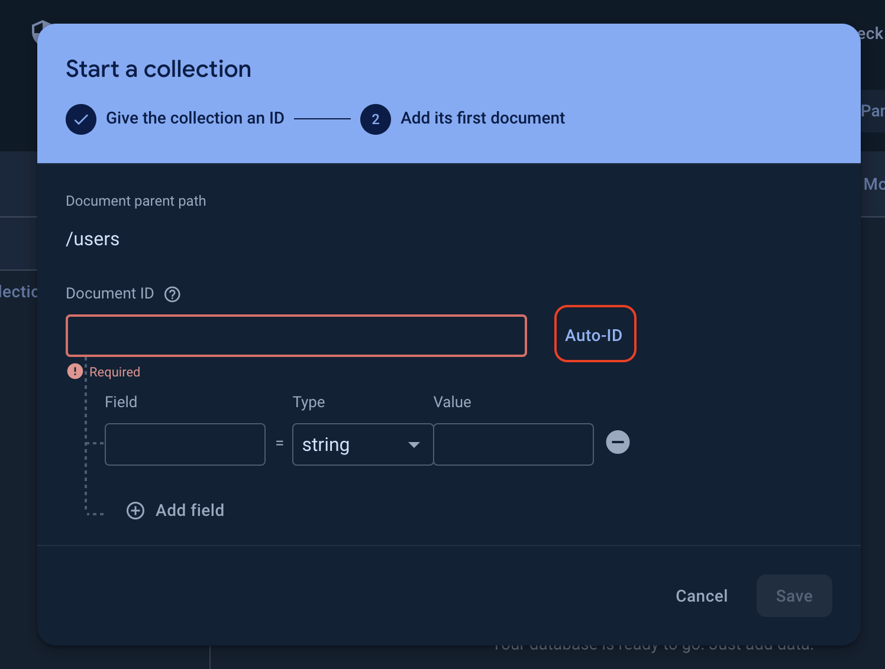

## Introduction

This repository is designed for educators or individuals interested in incorporating [ GPT-4 ](https://openai.com/gpt-4) or their customized [ GPT ](https://platform.openai.com/docs/assistants/overview) assistants into teaching pedagogies. It utilizes the [LINE Official Account](https://tw.linebiz.com/login/) and [LINE Developers](https://developers.line.biz/en/) platforms to create an educational [LINE Bot](https://developers.line.biz/en/docs/messaging-api/building-bot/). By employing teachers' LINE official accounts as a medium, this platform enables students to interact with teachers' custom GPTs via their personal [LINE](https://line.me/en/) accounts. Additionally, it allows teachers to monitor students' learning progress by reviewing their conversations with the GPTs. This `README` includes step-by-step instructions, covering everything from setting up a LINE Official Account and customizing your GPTs, to deploying the LINE Bot on Google Cloud Run for student access.

> **NOTE**:  
> To have you understand how to set things up better, I use videos on YouTube to guide you through some processes i.e. creating miscellaneous accounts. If you have any questions, feel free to [shoot me an email](mailto:891118heaven@gmail.com).

## Prerequisites

- **Basic understanding of GPT-4 or GPT-3** (`REQUIRED` so that you won't abuse them)
- I will take care of the rest : ).

## Table of Contents

- [Setting Up a LINE Official Account](#setting-up-a-line-official-account)
- [Setting Up an OpenAI API Account](#setting-up-openai-account)
  - [Creating an OpenAI Account](#creating-an-openai-account)
  - [Understanding API Pricing](#understanding-the-pricing)
  - [Creating an API Key](#creating-an-api-key)
  - [Customizing Your GPT](#customizing-your-gpt)
- [Setting Up a Firebase Account](#setting-up-a-firebase-account)
- [Forking this Repository](#forking-the-repository)
- [Setting Up a Google Cloud Account](#setting-up-a-google-cloud-account)
- [Creating a Cloud Run Service](#creating-a-cloud-run-service)

## Setting Up a LINE Official Account

1. Watch this [video](https://www.youtube.com/watch?v=qEeBDilsFAQ&list=PLTh3VLgiiGUiDM8n1ZFAbMarjz8FlCVBI) to set up your official account first
2. Then ensure your configuration is the same as the ones below:

   - settings > reply settings > reply function

     

   - settings > reply settings > ways of reply

     

3. Go to Messaging API and copy your `Channel Secret` and `Access Token` for later use.

## Setting Up an OpenAI API Account

### Creating an OpenAI Account

1. Go to https://platform.openai.com/docs/overview and sign up for an account.
2. [Set up your payment method](https://www.youtube.com/watch?v=tFQkgnw6a08).

#### Understanding API Pricing

Before integrating GPT-4 into your pedagogy, it's crucial to understand the pricing model of the OpenAI API. This subsection explains the cost associated with API requests.

- [Pricing Page](https://openai.com/pricing/)
- [Rate Limit](https://platform.openai.com/docs/guides/rate-limits?context=tier-free)

> **NOTE**:  
> Chinese characters usually count as 2 tokens, so be careful if your students are mandarin-speakers.

#### Creating an API Key

An API key is necessary to authenticate your requests to OpenAI. This part walks you through creating an API key so you can start customizing and using GPT models in your teaching.

1. [How to get your API key?](https://www.youtube.com/watch?v=nafDyRsVnXU)
2. Copy your API key and save it for later use.

#### Customizing Your GPT

Learn how to tailor GPT-4's responses to suit your educational content and objectives. This includes adjusting settings for tone, complexity, and relevance to your curriculum.

1. [Customizing your GPT](https://www.youtube.com/watch?v=aQIlZyasM-U&t=72s)
2. Copy your model ID and save it for later use.

   

## Setting Up a Firebase Account

### Setting Up a Firestore Project

1. Go to [Firebase](https://console.firebase.google.com/u/0/) and log in your google account.
2. Click `Create a project` and follow the instructions to create a new project.

   

3. Enter your project name, and agree to the terms and conditions.

   

4. Uncheck the `Google Analytics` box and click `Create Project`.

   

5. Click `Cloud Firestore` and `Create Database`.

   

   

6. Choose the data center closest to your location and click `Next`.

   

7. Choose `Start in production mode` and click `Create`.

   

8. Click `Start collection`, name the collection `users`, and click `Next`.

   

9. Click `Auto-ID` and `Save`.

   

### Storing Service Account Credentials

1. Go to `Project Settings` and click `Service Accounts`.

   

2. Click `Generate new private key` and save the JSON file for later use.

   

> **Why do I need firebase?**  
> According to the [ official documentation of the LINE Messaging API](https://developers.line.biz/en/reference/messaging-api/#get-content), there **IS NOT** an API available for retrieving text content. Consequently, it's necessary to have a storage solution for archiving the responses sent by students. This setup ensures that when students quote specific messages, our custom GPTs can understand the context they are referencing.

## Setting Up a GitHub Account

To allow Google Cloud Run to deploy your LINE Bot, you'll need to fork this repository. This section covers the steps to set up a GitHub account and fork this repository.

- [Set up a GitHub Account and Fork this project](https://www.youtube.com/watch?v=wbzfZKclh4I)

## Setting Up a Google Cloud Account

To deploy your LINE Bot, you'll need a Google Cloud Account. This section details the signup process and initial configuration steps to get your account ready for deployment.

- [Sign up for a Google Cloud Account.](https://www.youtube.com/watch?v=SwZEQiKdwq8)

## Creating a Cloud Run Service

... to be added
